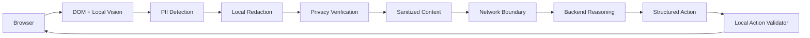

# On-device Visual Perception for Lightweight Browser Agents

<p align="center">
  
</p>

<p align="center">
  <a href="#"></a>
  <a href="#"></a>
  <a href="#"></a>
  <a href="#"></a>
  <a href="#"></a>
  <a href="#"></a>
</p>

This project explores a privacy-preserving design for browser agents that reason over page context without exposing sensitive user data to remote systems. The current repository implements a backend prototype that accepts sanitized browser context, performs rule-based action inference, and rejects requests unless privacy verification has already succeeded.

## Project Overview

Modern browser agents can inspect page elements, understand user intent, and propose actions such as clicking, typing, scrolling, or waiting. However, a webpage often contains sensitive information: passwords, email addresses, phone numbers, OTPs, financial identifiers, and other personal data. Feeding raw browser context to a remote AI model can unintentionally leak that information beyond the user's device.

This project focuses on a simple but important principle: sensitive information should be detected and protected locally before any context crosses the network boundary. In the current implementation, the backend is intentionally strict: it accepts only sanitized context, validates request structure, and emits only a limited set of safe browser actions rather than arbitrary executable instructions.

## The Problem

Browser agents that can observe a page and reason about it are useful, but they introduce a privacy risk when they send page content or screenshots to remote models. Even when the task is harmless, the surrounding page may contain confidential information that the model does not need to see.

The risk is especially significant for:

- passwords and credentials
- email addresses
- phone numbers
- OTPs and verification codes
- financial or card data
- identity numbers such as Aadhaar or PAN
- personal text that should remain local

The repository's data model includes explicit PII categories such as `password`, `email`, `phone`, `otp`, `pin`, `cvv`, `credit_card`, `debit_card`, `aadhaar`, `pan`, and related privacy labels. These categories reflect the current privacy focus of the implementation.

## Our Solution

The repository implements a privacy-first backend boundary around the browser-agent reasoning step. The architecture is intentionally constrained and local-first:

- browser context is treated as untrusted until sanitized
- privacy verification is required before processing
- only a fixed set of structured actions is returned
- no arbitrary JavaScript or executable instruction is generated
- the rule-based fallback reasoner remains separate from API contracts and can be replaced by a future local VLM provider



This repository is best described as a prototype and reference architecture for privacy-aware browser automation. The current implementation demonstrates the safety boundary and action-validation contract; it does not yet include a production-grade local VLM or full browser-extension execution layer.

## Key Features

- Local-first privacy contract for browser context
- PII-aware request schema with privacy region summaries
- Validation gate requiring `privacy_verified: true`
- Structured action outputs: click, type, scroll, and wait
- Rule-based reasoning fallback in the backend
- Explicit VLM provider interface for future local-model integration
- Safety limits on scroll and wait actions
- Strict request validation and error handling
- Automated backend tests covering the API contract and safety checks

## System Architecture

The repository currently centers on the backend and privacy boundary, while the browser extension, privacy detector, vision layer, and agent directories are present as project scaffolding or future components.

### 1. Browser Extension
The extension layer is expected to collect page context and send only sanitized content to the backend. In the current repository snapshot, the extension directory is present but not yet populated with implementation logic.

### 2. DOM / Visual Perception
The system is designed to reason over page structure and visual context. The backend accepts a list of UI element descriptors, screen metadata, and an optional sanitized image field. The current reasoner uses sanitized UI metadata rather than raw visual analysis.

### 3. Privacy Detection
The privacy model includes patterns for password, email, phone, OTP, card, Aadhaar, PAN, and related personal identifiers. Sensitive regions are represented as structured summaries instead of exposing raw values to the backend.

### 4. Redaction
Sensitive regions are expected to be redacted or masked before network transmission. This is represented as a privacy-region summary with a redaction type and bounding box.

### 5. Privacy Verification
The backend explicitly rejects requests where `privacy_verified` is false. This creates a safety checkpoint before the reasoning layer can act.

### 6. Backend / Reasoning Layer
The main implementation lives in `server/`: FastAPI app, request schemas, action reasoning, VLM abstraction, and automated tests. This is the active logic in the repository.

### 7. Action Validator
The system validates the inferred action before it is returned. Only known safe action models are accepted; unsupported or arbitrary action types are rejected.

### 8. Browser Execution
The project intends to enable browser execution only after a validated action passes the local safety boundary. The current code demonstrates the API contract and validation layer but not full browser automation.

## Privacy by Design

This is the core design principle of the repository.

Sensitive data should be detected locally and never sent upstream in raw form. The backend is intentionally designed to accept only sanitized context. Once privacy verification succeeds, the system can proceed with a limited action inference loop. This means:

- sensitive regions are identified locally
- those regions are redacted or masked before transmission
- privacy verification acts as a boundary gate
- only safe, sanitized context crosses the network boundary
- generated actions are constrained to a known set of valid browser interactions
- action execution is gated by local validation before the browser acts

This design is intentionally simpler and safer than sending a full page snapshot or raw browser state to an external AI service.

## Tech Stack

| Layer | Technology |
|------|------------|
| Backend | Python |
| API framework | FastAPI |
| Validation | Pydantic |
| ASGI server | Uvicorn |
| Testing | unittest |
| Browser integration | Browser-extension-oriented design, scaffolded in repo |
| Privacy model | Custom PII taxonomy and redaction metadata |

## Project Structure

```text
SIH2026/
├── agent/
├── assets/
├── docs/
├── extension/
├── privacy/
├── server/
│   ├── main.py
│   ├── reasoning.py
│   ├── schemas.py
│   ├── test_server.py
│   ├── vlm.py
│   ├── requirements.txt
│   ├── requirements-test.txt
│   └── README.md
├── tests/
├── vision/
├── .gitignore
├── README.md
└── LICENSE (if added in the future)
```

Key directories:

- `server/` — active implementation: FastAPI backend, schemas, reasoning, and tests
- `privacy/` — privacy detection and redaction concepts intended for local processing
- `vision/` — visual perception and screen-analysis components
- `extension/` — browser extension layer scaffold
- `agent/` — browser-agent orchestration and decision logic
- `docs/` — project documentation and design notes
- `tests/` — project testing area; the active suite is currently in `server/test_server.py`

## How It Works

1. A user interacts with a webpage or a browser automation scenario.
2. Browser-side components gather only the necessary page context.
3. Local privacy checks identify sensitive regions and metadata.
4. Sensitive text or visual areas are redacted or masked before any remote reasoning.
5. A privacy verification step confirms the context is safe to send.
6. The backend receives a sanitized request with validated metadata.
7. The rule-based reasoning layer maps the instruction to a supported action.
8. The action is validated against a strict set of safe response models.
9. The backend returns a single structured action such as click, type, scroll, or wait.
10. The browser executes only the validated action.

## Demo

This repository currently contains a backend prototype rather than a complete end-user browser demo. The most direct way to explore the project is to run the FastAPI service and use the interactive Swagger UI provided by FastAPI.

Start the backend:

```bash
cd server
pip install -r requirements.txt
uvicorn main:app --reload
```

Then open:

- http://127.0.0.1:8000
- http://127.0.0.1:8000/docs

The API contract includes the `POST /api/v1/action` route and the demo-only `POST /api/v1/privacy-check` endpoint. The repository does not include a real browser extension demo or product screenshots at this stage.

## Run Locally

From the repository root:

```bash
cd server
pip install -r requirements.txt
uvicorn main:app --reload
```

The service runs locally on port 8000 and exposes the OpenAPI docs at `/docs`.

## Testing

The active automated test suite is in `server/test_server.py` and uses Python's built-in `unittest` framework together with FastAPI's `TestClient`.

Run the current tests:

```bash
cd server
pip install -r requirements.txt -r requirements-test.txt
python -m unittest test_server.py -v
```

The current implementation includes a focused contract test suite covering health checks, supported actions, privacy rejection, target lookup errors, validation failures, and provider boundaries.

## Project Status

### Implemented

- Privacy-first backend API contract
- Sanitized context request model with privacy verification gate
- PII metadata and privacy region summaries
- Rule-based action reasoning for click, type, scroll, and wait
- VLM abstraction with fallback provider pattern
- Response validation against a restricted action schema
- Backend health endpoint and demo privacy-check route
- Automated tests for contract and safety behavior

### Planned / Future Scope

- Real on-device vision processing
- Browser extension integration with the local privacy pipeline
- Local VLM or LLM provider selection and benchmarking
- More robust PII detection and redaction in live browser contexts
- Stronger browser automation coverage and execution validation
- Expanded privacy evaluation for visual and DOM-based leakage
- Packaging for a more complete demo experience

## Future Scope

A realistic roadmap for this project includes:

- stronger local vision models for page understanding
- improved browser coverage and event handling
- deeper action-planning workflows for multi-step agent tasks
- more comprehensive privacy detection across visual and DOM-derived content
- lower-latency local inference for constrained devices
- broader browser and OS integration for real-world deployment

## Team

The repository does not currently include a formal contributor roster or team page. As the project evolves, this section can be updated with the actual team members and roles.

## Why This Matters

This project addresses a practical requirement for trustworthy AI-driven browser automation: users should not have to choose between useful assistance and privacy exposure. By pushing detection, redaction, and verification to the device boundary, the system reduces unnecessary leakage of personal information while still enabling local reasoning and structured action generation.

## Visual Assets

The repository includes a minimal set of lightweight SVG assets designed for GitHub rendering.


## Badges

The README uses only badges that are supported by the repository evidence and project context.

- SIH 2026
- Problem Statement 171
- ISRO
- Python
- FastAPI
- Privacy-first

## README Quality Check

This README was written to be concise, accurate, and aligned with the actual repository state. It avoids claiming features that are not implemented and clearly distinguishes between the current prototype and future architecture.

## Git Safety

No git commands were run beyond repository inspection. The project was not committed, pushed, or reset.
