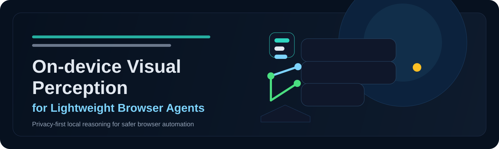
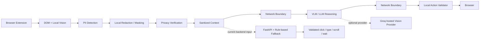
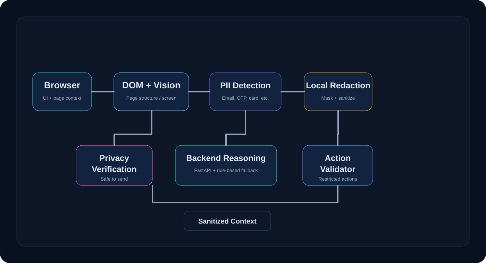
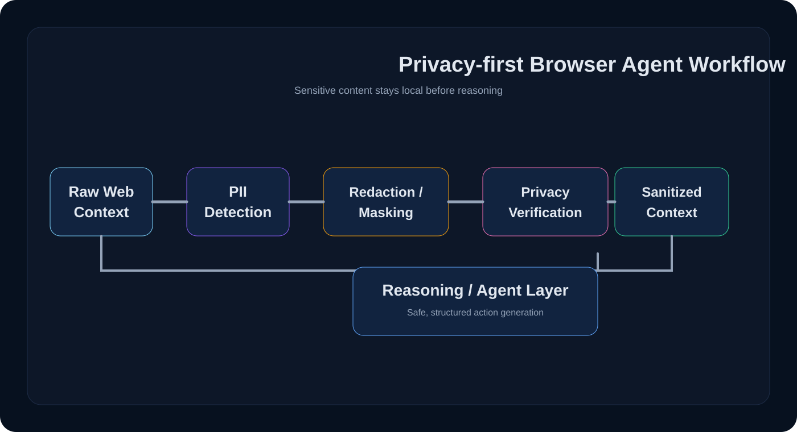

<div align="center">

# On-device Visual Perception for Lightweight Browser Agents

### SIH 2026 — Problem Statement 171

A privacy-first browser-agent prototype that combines DOM understanding, local visual perception, sensitive-data protection, and validated browser actions.

[](https://www.sih.gov.in/)
[](#problem-statement)
[](#tech-stack)
[](#backend)

</div>

<p align="center">
    
</p>

## Project Overview

This project addresses a core problem in browser automation: a browser agent can understand a page and decide what to do, but the page often contains sensitive information that should never be exposed to a remote reasoning system.

A lightweight browser agent must interpret page structure and visual cues while staying privacy-aware. The current repository is a prototype for that idea: it models a privacy boundary around browser context and restricts reasoning to sanitized inputs and validated action outputs.

From a system-design perspective, the core idea is straightforward:

- the browser can observe relevant page content
- sensitive values can be detected locally
- information can be redacted or masked before transmission
- only sanitized context moves beyond the device boundary
- the reasoning step returns a limited, safe set of browser actions

This is a prototype and an architectural reference rather than a production browser agent stack. The active implementation is the backend and its privacy-aware API contract.

## Problem Statement

Problem Statement 171 asks for a lightweight browser agent that can understand webpages and take useful actions while preserving user privacy. The challenge is that webpages often contain both routine interface elements and sensitive information such as personal records, financial identifiers, login details, or OTPs.

A browser agent that sends raw DOM content or screenshots to a remote AI service can unintentionally expose data that is unrelated to the task. The repository addresses this by modeling a privacy gate before the reasoning layer and by constraining output to structured actions instead of arbitrary commands.

Important privacy categories reflected in the repository include:

- password
- email
- phone
- otp
- pin
- cvv
- credit_card
- debit_card
- aadhaar
- pan
- passport
- driving_license
- account_number
- date_of_birth
- face
- personal_text

## Our Solution

The intended privacy-first browser-agent pipeline is built around two explicit network boundaries:



The implemented portion is the privacy-aware backend contract, rule-based action inference, action validation, and optional Groq-hosted vision provider. The browser extension, live local vision stages, and full browser execution loop are not fully shipped in this repository snapshot. The default provider remains rule-based; the optional hosted provider requires an API key and is covered by mocked tests.

### Current Status at a Glance

| Layer | Status | Evidence in this repository |
|---|---|---|
| Sanitized request schema | Implemented | Pydantic models in `server/schemas.py` |
| Privacy verification gate | Implemented | `privacy_verified` enforcement in `server/main.py` |
| Rule-based action inference | Implemented | `server/reasoning.py` and fallback provider in `server/vlm.py` |
| Model-agnostic reasoning boundary | Implemented | `VLMProvider` and `create_provider()` in `server/vlm.py` |
| Optional Groq-hosted VLM provider | Implemented, opt-in | `server/groq_provider.py` with mocked provider tests |
| Browser extension runtime | In Progress / Planned | Extension folder exists but is not populated with functional runtime code |
| Local visual perception | In Progress / Planned | Vision folder exists as project structure |
| Full browser agent execution | Planned | Not implemented in the current codebase |
| On-device VLM integration | Planned | No local model runtime is implemented in the current codebase |

## Key Features

- Privacy-aware request validation through a strict backend contract
- Local-first processing model that rejects unverified context
- PII metadata and privacy-region summaries in the schema layer
- Sanitized context handling for action inference
- Structured browser actions: click, type, scroll, and wait
- Rule-based reasoning fallback with a model-agnostic provider boundary
- Optional Groq-hosted open-weight vision provider behind the same boundary
- Action validation to prevent unsupported or dangerous outputs
- Automated FastAPI-based backend tests covering validation and safety behavior
- Prototype architecture designed to support on-device VLM inference later

## System Architecture

The repository is intentionally modular, even though several folders are currently scaffolded rather than fully implemented.

### Browser Extension
The extension directory is part of the project structure and is intended to collect browser context, but it is not populated with a complete runtime implementation in this repository snapshot.

### DOM + Visual Perception
The backend accepts UI elements, screen dimensions, and an optional sanitized image field. This reflects a design where browser context can be inspected locally before reaching the model boundary.

### Privacy / PII Detection
The privacy schema includes explicit sensitive-data classifications, including password, OTP, card, Aadhaar, PAN, and personal identifiers. These are tracked as structured privacy-region summaries instead of passing raw values downstream.

### Redaction / Masking
Sensitive regions are expected to be redacted before sending data beyond the browser. The schema models region type, bounding box, and redaction style.

### Privacy Verification
The backend checks `privacy_verified` before it will infer an action. If verification is false, the request is rejected.

### Backend / Reasoning Layer
The active implementation is in the `server/` folder. It contains the FastAPI backend, Pydantic schemas, rule-based action reasoning, and the VLM abstraction used as a provider boundary.

### Action Validation
The system validates output against a restricted set of supported action types and rejects unsupported or arbitrary action objects.

### Browser Execution
The browser execution layer is planned as the next stage. The current code proves the safety boundary and structured action contract, but does not implement a full browser automation runner.

## Privacy by Design

Privacy is the primary architectural idea behind this project.

1. Sensitive information should be detected locally where possible.
2. Data and visual regions containing personal content should be identified.
3. Sensitive values should be redacted, masked, or removed before network transmission.
4. Privacy verification should happen before any sensitive context crosses the boundary.
5. Only sanitized context should reach the reasoning layer.
6. The reasoning layer should not receive raw page screenshots or credentials unless explicitly sanitized and verified.
7. The tool should return only a limited set of structured browser actions, not arbitrary executable instructions.

Examples supported by the repository include email, phone numbers, passwords, OTPs, credit/debit card data, Aadhaar, PAN, and other personal identifiers.

## How It Works

### Step 1 — Observe
The browser or local page context is inspected for relevant UI elements and page structure.

### Step 2 — Detect
Potential privacy issues are identified and represented as region metadata or PII categories.

### Step 3 — Protect
Sensitive content is redacted or masked before it is sent onward.

### Step 4 — Verify
The request is required to pass a privacy verification check before processing continues.

### Step 5 — Reason
The backend uses the sanitized request and a rule-based fallback reasoner to infer an action.

### Step 6 — Validate
The action is checked against the supported action models and rejected if invalid.

### Step 7 — Execute
Only a safe, structured action is returned for browser execution.

## Project Components

| Component | Purpose |
|---|---|
| `agent/` | Agent-side orchestration and browser-agent concepts |
| `extension/` | Browser extension layer scaffold |
| `privacy/` | Privacy detection and sensitive-data handling |
| `server/` | Active FastAPI backend, request schemas, reasoning logic, and tests |
| `vision/` | Visual perception and screen-analysis concepts |
| `tests/` | Testing area for repository validation |
| `docs/` | Documentation area; currently scaffolded |

## Tech Stack

### Frontend / Browser
- Browser extension architecture
- DOM-driven UI element parsing
- Browser-oriented context collection

### Backend
- Python
- FastAPI
- Pydantic
- Uvicorn

### Privacy / Safety
- PII classification schema
- Privacy-region metadata
- Redaction / masking model
- Privacy verification gate

### AI / Reasoning
- Model-agnostic VLM boundary
- Rule-based fallback implementation
- Optional Groq-hosted Llama 3.2 Vision provider
- Structured action output contract

### Testing
- Python `unittest`
- FastAPI `TestClient`

## Repository Structure

```text
SIH2026/
├── agent/
├── assets/
│   ├── hero.svg
│   ├── architecture.svg
│   └── privacy-flow.svg
├── docs/
├── extension/
├── privacy/
├── server/
│   ├── main.py
│   ├── reasoning.py
│   ├── schemas.py
│   ├── groq_provider.py
│   ├── vlm.py
│   ├── test_server.py
│   ├── test_groq_provider.py
│   ├── requirements.txt
│   ├── requirements-test.txt
│   └── README.md
├── tests/
├── vision/
├── .gitignore
└── README.md
```

The active implementation is in `server/`. Other folders are part of the overall system design and project structure but are not fully implemented in this snapshot.

## Backend

The current backend is a FastAPI service that accepts sanitized browser context and returns a single supported browser action.

The implemented logic verifies that:

- the request schema is valid
- `privacy_verified` is true
- the instruction maps to a supported action type
- the action target exists in the provided elements
- only a generated action from a constrained set is returned

The VLM layer is intentionally model-agnostic. The default provider is a
fallback that adapts the existing safe reasoning implementation. An optional
Groq-hosted open-weight vision provider also implements the same interface and
is covered by mocked tests. A future on-device VLM can use this boundary
without changing the API contract.

## API

| Method | Endpoint | Purpose |
|---|---|---|
| GET | `/health` | Health check for the backend |
| POST | `/api/v1/action` | Accept sanitized context and return one validated action |
| POST | `/api/v1/privacy-check` | Demo-only privacy check endpoint for page text analysis |

### Request Contract
The backend request includes:

- `request_id`
- `privacy_verified`
- `screen`
- `elements`
- `privacy_regions`
- `image` (optional, sanitized only)
- `instruction` (optional but required for target-based action inference)

### Response Contract
The response contains:

- `request_id`
- `success: true`
- `action` with one of the supported action models

## Action Types

The current backend supports only a limited and validated set of structured actions:

- `click`: target a visible UI element
- `type`: target an element and enter a value
- `scroll`: direction and bounded amount
- `wait`: bounded duration in milliseconds

These actions are structured and validated rather than arbitrary JavaScript or executable commands.

## Getting Started

### Prerequisites

- Python 3.x
- Git
- A local terminal or VS Code terminal

### Clone

```bash
git clone <repository-url>
cd SIH2026
```

### Create a virtual environment

```bash
python -m venv .venv
```

Windows:

```powershell
.venv\Scripts\activate
```

Linux/macOS:

```bash
source .venv/bin/activate
```

### Install dependencies

```bash
cd server
pip install -r requirements.txt
```

For the test environment:

```bash
pip install -r requirements-test.txt
```

## Running the Project

### Backend

```bash
cd server
uvicorn main:app --reload
```

The service is available locally at:

- http://127.0.0.1:8000
- http://127.0.0.1:8000/docs

### Optional hosted VLM provider

The default provider is the local rule-based fallback. An opt-in Groq-hosted
open-weight vision provider is also implemented behind the same validated
boundary. It requires a `GROQ_API_KEY` and sends only context that has already
passed the repository's privacy verification contract.

```powershell
$env:MODEL_PROVIDER = "groq"
$env:GROQ_API_KEY = "your-key"
$env:MODEL_NAME = "llama-3.2-11b-vision-preview"
uvicorn main:app --reload
```

This is not an on-device inference implementation, and it does not provide the
missing browser extension or full execution loop.

### Browser extension
No complete browser extension runtime is present in this repository snapshot. The folder is included as part of the project structure and is intended for future integration.

## Testing

The repository currently includes automated backend tests in `server/test_server.py` using Python's built-in `unittest` framework and FastAPI's `TestClient`.

Run the test suite:

```bash
cd server
pip install -r requirements.txt -r requirements-test.txt
python -m unittest test_server.py -v
```

The code documents the test suite as covering the health endpoint, action generation, privacy rejection, target lookup errors, request validation, and provider-selection behavior.

## Demo

This repository does not currently include a production demo, screenshots, or a full browser-automation walkthrough. The most concrete runnable demo is the FastAPI backend and its Swagger UI. The optional Groq provider can be exercised through the same API after configuration.

The repository includes lightweight SVG diagrams below; a production browser demo is future work.

## Visual Assets

The project includes lightweight SVG assets that are suitable for GitHub and easy to scale.






## Team

| Member | Responsibility |
|---|---|
| Divya | DOM + Browser Extension |
| Hema | Local Vision / WebGPU |
| Shivani | Privacy & PII Detection |
| Shiva | Redaction + Privacy Verification |
| Arif | Backend + VLM / LLM |
| Kaveri | Action Validator + Agent Loop + Evaluation |

## Project Status

### Implemented

- Privacy-first backend API contract
- Sanitized context request model
- Privacy verification gate
- PII categories and privacy-region schema
- Rule-based browser action reasoning
- Support for click, type, scroll, and wait actions
- Base VLM abstraction and provider selection logic
- Optional Groq-hosted vision provider with mocked HTTP tests
- Backend health endpoint and validation behavior
- Automated test suite for the backend contract

### In Progress

- Browser extension integration
- Local vision pipeline
- Privacy detection and redaction workflow in a live browser context
- Deeper browser-agent action orchestration

### Planned

- Real on-device visual perception pipeline
- Browser-side redaction and verification in the extension
- On-device VLM or lightweight local model integration
- Extended action planning for multi-step tasks
- Broader browser compatibility and execution validation
- Benchmarking and evaluation workflow

## Future Scope

Future work for this project includes:

- stronger local visual models for webpage understanding
- better browser coverage and event-handling robustness
- richer PII detection in visual and DOM-derived context
- more capable local reasoning agents for real-world tasks
- WebGPU or optimized local inference paths where appropriate
- evaluation pipelines for action quality, privacy safety, and redaction effectiveness

## Hackathon Information

- **Event:** Smart India Hackathon 2026
- **Problem statement:** 171 — On-device Visual Perception for Light-weight Browser Agents
- **Project focus:** Privacy-preserving browser agents with local visual perception, sanitized context, and validated actions
- **Runnable surface today:** FastAPI backend in `server/`

## Why This Matters

This project matters because it addresses a core trust issue in AI-assisted browser automation. If browser agents can read pages and act on user intent, they must also be designed to avoid leakage of unnecessary personal and sensitive information. A local-first, privacy-aware approach reduces exposure while preserving useful agent behavior.

## Security / Privacy Warning

This repository is a prototype and research-oriented project. It demonstrates a privacy-aware architecture and validation boundary, but it should not be treated as production-hardened security software without further testing, hardening, and deployment review.

## Documentation Links

The repository currently contains a minimal set of project folders and scaffolded documentation areas. There are no formal additional docs files that are complete enough to link from the root README beyond the server README and the project folders themselves.

## License

No license file was found in the repository, so no license section is included.

